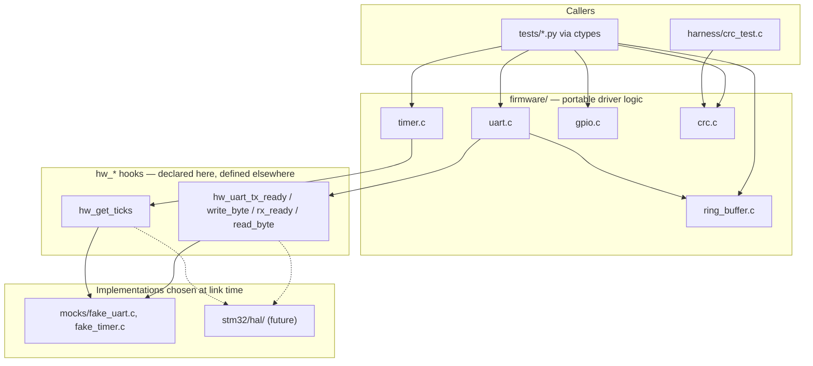
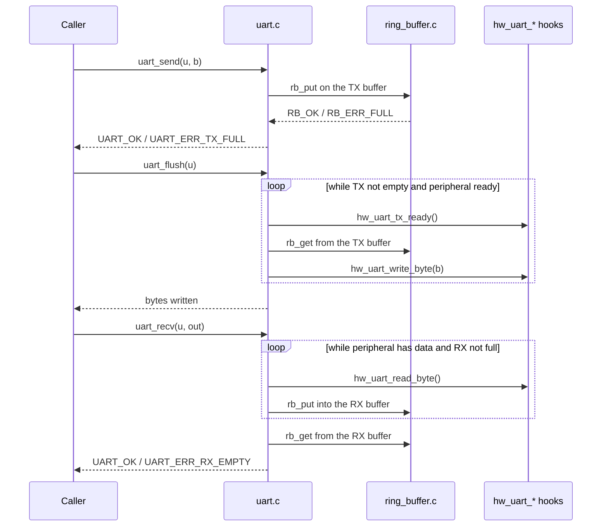

# firmware/ — The C code under test

The actual product code: five small, target-agnostic embedded drivers. Everything in this
directory is written the way production MCU firmware is written — no dynamic allocation, no
hidden global state, all state in caller-owned structs — and it is compiled by the real
compiler with `-Wall -Wextra -Werror`. Nothing here knows that it is being tested.

The drivers never touch a peripheral register directly. They reach the outside world only
through a few `hw_*` hook functions that are *declared* here and *defined* somewhere else:
`mocks/` on the host today, a real STM32 HAL later. That single indirection is what lets the
same unmodified source run under Python tests and on silicon.

## Files

| File | Purpose |
| --- | --- |
| `ring_buffer.h` / `.c` | Fixed-capacity (64-byte) single-producer/single-consumer FIFO. Modulo index arithmetic, explicit `count`, no allocation. Backing store for the UART queues. |
| `crc.h` / `.c` | CRC-32 (IEEE 802.3, reflected): `poly=0xEDB88320`, `init=0xFFFFFFFF`, final XOR. Bitwise rather than table-driven — trades cycles for flash, the usual small-MCU choice. One-shot `crc32()` plus an incremental `init`/`update`/`final` trio. |
| `gpio.h` / `.c` | Bit-banged GPIO over an STM32-shaped register bank (`MODER` 2 bits/pin, `ODR`, `IDR`), 16 pins. Pure bit manipulation on a struct the caller owns. |
| `timer.h` / `.c` | Software timeout timer. Reads time only via `hw_get_ticks()`; unsigned 32-bit subtraction makes elapsed-time math rollover-safe. |
| `uart.h` / `.c` | Buffered UART. Two ring buffers (TX/RX) between the application and the `hw_uart_*` hooks; handles peripheral back-pressure and software FIFO overflow. |

Conventions shared by all five modules: functions return `0` on success and a negative
module-specific error code on failure (`RB_ERR_FULL`, `GPIO_ERR_RANGE`, `UART_ERR_TX_FULL`,
…), and every entry point rejects a `NULL` handle instead of dereferencing it. The negative
codes are what the Python tests assert on.

## Architecture

`crc` and `gpio` are self-contained. `uart` is the only module that composes another
(`ring_buffer`), and `uart`/`timer` are the only ones with a hardware seam.



Byte flow through the UART module, which is the one place several pieces cooperate:



## Why both `.c` and `.h` files?

C has no modules, no `import`, and no namespaces. The compiler processes one **translation
unit** at a time — a single `.c` file plus everything it textually `#include`s — and it knows
absolutely nothing about any other `.c` file in the project. The `.h`/`.c` split is how C
works around that:

- A **header (`.h`)** holds *declarations*: what exists, its type, its calling convention.
  Function prototypes, `typedef`s, `struct` layouts, `enum`s, and macros. It contains no
  executable code, is meant to be read by humans as the module's API contract, and gets
  textually pasted into every file that includes it.
- A **source file (`.c`)** holds *definitions*: the actual function bodies and any
  file-local (`static`) state. It is compiled exactly once into an object file.

Without the split, `uart.c` would have no legal way to call `rb_put()`: the compiler would
hit an unknown identifier and stop. `#include "ring_buffer.h"` supplies the prototype so the
call type-checks, and the **linker** later connects that call to the machine code compiled
from `ring_buffer.c`. Compile time checks the *shape* of the call; link time resolves the
*address*.

Four consequences worth understanding in this repo specifically:

**1. The hook declarations are the mock seam.** `uart.h` declares `hw_uart_write_byte()` but
`uart.c` never defines it. That is not an oversight — it is the entire design. `uart.c`
compiles cleanly against the promise that *someone* will provide that symbol, and the
`Makefile` decides who:

```
libuart.so  = firmware/uart.c + firmware/ring_buffer.c + mocks/fake_uart.c
```

Swap `mocks/fake_uart.c` for a real `stm32/hal/uart_hal.c` and the driver source does not
change by a single character. If the split did not exist, the implementation and the contract
would be welded together and this substitution would be impossible.

**2. Complete types must be in the header; opaque ones need not be.** `uart_t` embeds two
`rb_t` structs *by value*, so the compiler has to know `sizeof(rb_t)` and its field offsets
to lay out `uart_t` — which is why `uart.h` does a full `#include "ring_buffer.h"` rather
than a forward declaration. Contrast `mocks/mock_hw.h`, which only ever returns a
`struct gpio_port *`; a pointer is the same size regardless of what it points at, so a bare
forward declaration (`struct gpio_port;`) suffices and the mock header avoids depending on
`gpio.h`.

**3. The headers are the schema the Python tests mirror.** Mock-hardware tests load a shared
library with `ctypes` and re-declare each struct on the Python side:

```python
class RingBuffer(ctypes.Structure):
    _fields_ = [("buf", ctypes.c_ubyte * 64), ("head", ctypes.c_size_t), ...]
```

Nothing automatically synchronizes that with `ring_buffer.h`. Reorder the fields in the
header, change `RB_CAPACITY`, or widen a type, and the mirror in `tests/test_ring_buffer.py`
(and `tests/test_uart.py`) has to be updated in lockstep or the tests will read garbage.
Treat the headers as the ABI contract for both C *and* Python consumers.

**4. Headers keep rebuilds and binaries small.** Each `.c` compiles independently, so editing
a function body recompiles one object file instead of the project. And because a definition
lives in exactly one translation unit, linking several modules that all include
`ring_buffer.h` yields one copy of `rb_put`, not one per includer — no duplicate-symbol
errors.

House rules followed here: every header is wrapped in an include guard
(`#ifndef RING_BUFFER_H` … `#endif`) so repeated inclusion is harmless; headers include only
what they need (`<stddef.h>`, `<stdint.h>`) and never pull in implementation details; and each
`.c` includes its own header first, which makes the compiler verify that the definitions match
the declarations it publishes.

## Building

Compiled by both `framework/build.py` (via `framework/config.py`'s `LIBRARIES` map) and the
top-level `Makefile`, always with `-g -O0 -std=c11 -Wall -Wextra -Werror -Ifirmware -Imocks`.
`-g -O0` is non-negotiable: `framework/gdb.py` needs accurate line numbers and unoptimized
locals to produce a useful backtrace. Artifacts land in `runtime/` as `lib<module>.so`.
