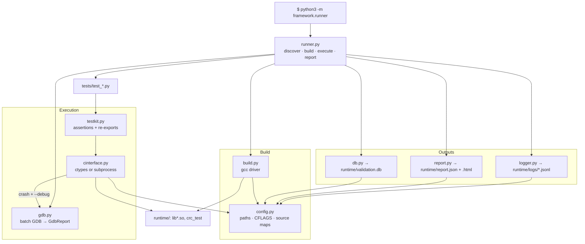
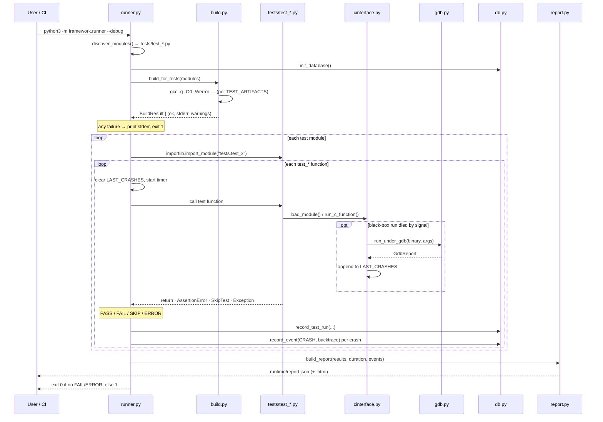

# framework/ — The validation framework

A dependency-free (stdlib-only) Python framework that compiles the C in `firmware/`, runs the
tests in `tests/` against the resulting binaries, drops into GDB when something crashes, and
persists the outcome as JSON, HTML, SQLite rows, and JSONL logs.

No pip install, ever. Everything here uses `subprocess`, `ctypes`, `sqlite3`, `json`, and
`argparse` — partly to keep the lab reproducible on a bare validation box, partly because a
framework with no dependencies cannot rot.

Two ideas shape the design. First, **the framework compiles the code it tests**, so a build
warning is a test result, not console noise, and `-g -O0` can be guaranteed for the debugger.
Second, **the results contract is shared** with the sibling system-tier project: the same
SQLite schema and the same report JSON shape, so one dashboard can ingest both tiers.

## Files

| File | Purpose |
| --- | --- |
| `config.py` | Single source of truth. Paths, `CC`, the `CFLAGS` list, the optional sanitizer profile, and three maps: `LIBRARIES` (which `.c` files link into each `lib<name>.so`), `EXECUTABLES` (black-box binaries), and `TEST_ARTIFACTS` (which artifacts each test module needs). Adding a module is mostly an edit to this file. |
| `build.py` | The gcc driver. Compiles shared libraries with `-fPIC -shared` and executables plain, into `runtime/`. Returns a `BuildResult` per artifact carrying the exact command, stderr, and parsed warnings. `build_for_tests()` builds only what the selected modules declare. Runnable directly: `python3 -m framework.build`. |
| `cinterface.py` | The Python↔C bridge, and the heart of the framework. `load_module()` returns a cached `ctypes.CDLL` for white-box mode; `run_c_function()` runs a black-box executable and returns a `ProcResult` exposing stdout, exit code, and — via the POSIX negative-returncode convention — the terminating `signal`. When `DEBUG` is on and a run dies by signal, it re-runs the binary under GDB itself and records the report in `LAST_CRASHES`. |
| `gdb.py` | Batch-mode GDB automation. Drives `gdb -q -batch -nx` through a fixed command list, emitting sentinel markers so the raw output can be sliced into a structured `GdbReport` (signal, `backtrace full`, registers, locals, args). `format_report()` condenses it for the console. Degrades gracefully to `available=False` when `gdb` is not on PATH. |
| `runner.py` | Execution engine and CLI (`python3 -m framework.runner`). Discovers `tests/test_*.py`, builds their artifacts, imports each module, collects `test_*` callables, runs them while classifying the outcome, and fans results out to the logger, the database, and the report. Its exit code is the suite's verdict. |
| `testkit.py` | The surface tests import. Re-exports `load_module` / `run_c_function` so tests never touch `cinterface` directly, and adds `assert_eq`, `assert_true`, `assert_signal`, `carray()` (bytes → `uint8_t[]`), and the `SkipTest` exception. |
| `db.py` | SQLite persistence: `test_runs` and `events` tables, a context-managed connection, insert helpers, and recent-history queries. The schema is copied from the sibling project rather than imported, to keep this codebase dependency-free. |
| `report.py` | Builds the report dict — summary counts, exit code, failure breakdown, per-test rows, and an `events` list for GDB backtraces — then writes `runtime/report.json` and, on request, a self-contained `runtime/report.html`. |
| `logger.py` | Structured JSONL logging: one `{timestamp, level, component, event, ...}` object per line to `runtime/logs/<component>.jsonl`, optionally echoed to stderr with `--verbose`. Greppable, tailable, and trivially ingestible. |
| `__init__.py` | Package marker and `__version__`. |

## Architecture

`config.py` sits at the bottom and everything reads from it; `runner.py` sits at the top and
orchestrates. Tests only ever see `testkit.py`, which keeps the bridge swappable — the
on-target plan in `stm32/README.md` replaces `cinterface.py`'s transport without touching a
single test.

## A run, end to end

Outcome classification is the one piece of runner logic worth memorizing, because it decides
what CI sees:

| Test function does | Result | Counted as failure |
| --- | --- | --- |
| returns normally | `PASS` | no |
| raises `AssertionError` | `FAIL` | yes |
| raises `SkipTest` | `SKIP` | no |
| raises anything else | `ERROR` (with traceback) | yes |
| fails to import | `ERROR` at module level | yes |

## Conventions

- **Flags live in `config.py`.** `-g -O0 -std=c11 -Wall -Wextra -Werror -Ifirmware -Imocks`.
  `-Werror` makes warnings blocking; `-g -O0` is what makes `gdb.py`'s line numbers and locals
  meaningful. The top-level `Makefile` mirrors this set by hand — edit one, edit the other.
  `FVLAB_SANITIZE=1` adds ASan/UBSan (`make SANITIZE=1` for the Make path).
- **Build only what's needed.** `TEST_ARTIFACTS` lets a single-module run skip four of five
  compiles. `--no-build` skips gcc entirely and reuses `runtime/`.
- **`runtime/` is disposable.** Every artifact, log, database, and report is generated and
  gitignored; `make clean` removes it.
- **Crashes are data.** A segfault becomes a `CRASH` row in `events` plus an entry in the
  report's `events` list, not a lost console message. `--gdb test_crc` drives the known crash
  path on demand.
- **Missing tools degrade, they don't explode.** With no `gdb` on PATH, `run_under_gdb()`
  returns `GdbReport(available=False)` carrying an explanatory message and `--gdb` exits `3`
  with a clear error — the suite itself still runs on a stripped box.
- **The output contract is fixed.** The `test_runs`/`events` schema and the report JSON keys
  are shared with the sibling system-tier lab. Treat them as a published interface — see
  `PLAN.MD` §11 before changing a column or key.

## Extending

- **New firmware module**: add it to `LIBRARIES` in `config.py`, add a `TEST_ARTIFACTS` entry
  mapping `test_<module>` to it, write `tests/test_<module>.py`, and mirror the rule in the
  `Makefile`.
- **New black-box binary**: add it to `EXECUTABLES` and to the owning module's `exes` list.
- **New assertion helper**: put it in `testkit.py` so it is importable from every test.
- **New transport (on-target)**: implement the `load_module` / `run_c_function` equivalents in
  `cinterface.py` over serial or GDB/RSP. Nothing above that boundary changes — see
  `stm32/README.md`.
