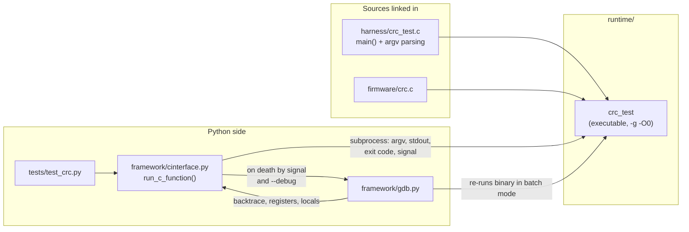
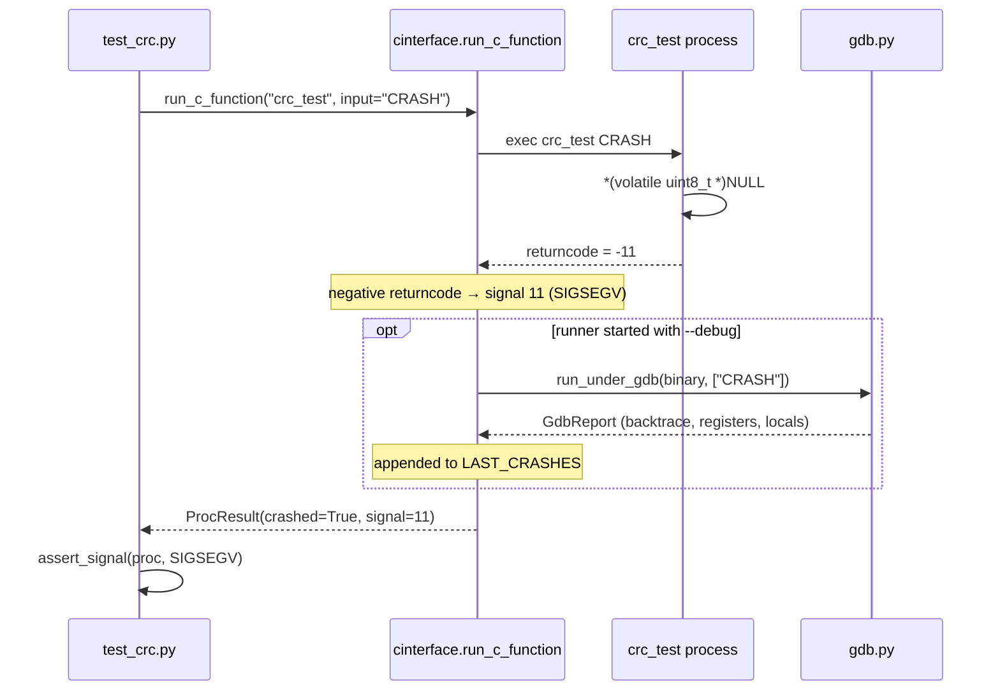

# harness/ — Black-box C entrypoints

Small standalone programs with a `main()` that expose one firmware module over a command-line
interface. They compile to real executables in `runtime/`, and the framework drives them with
`subprocess` instead of `ctypes`.

This is the counterpart to mock-hardware mode. In white-box tests Python lives *inside* the
process and can poke struct fields; here Python stays outside and sees only argv, stdout,
the exit code, and — the reason this mode exists — the terminating **signal**. A test that
needs to prove a fault kills the program cannot run in-process, because a SIGSEGV inside a
`ctypes` call takes the Python interpreter down with it. A separate process contains the
damage and gives GDB something to attach to.

## Files

| File | Purpose |
| --- | --- |
| `crc_test.c` | CLI wrapper around `firmware/crc.c`. `crc_test <string>` prints the CRC-32 of the argument as 8 lowercase hex digits (`crc_test 123456789` → `cbf43926`); missing argument exits `2`. The literal input `CRASH` dereferences a NULL pointer on purpose, producing the SIGSEGV that demonstrates automatic GDB capture. |

A harness should stay this thin. It parses argv, calls the driver, prints a result in a format
that is trivial to diff, and does no validation of its own — the assertions belong in
`tests/`.

## How it fits together

The crash path is the interesting one, because nothing in the test asks for a debugger — the
framework notices the signal and reaches for GDB on its own:

The runner then folds anything in `LAST_CRASHES` into the report and the `events` table as a
`CRASH` row, so a segfault becomes a durable, reviewable artifact rather than console noise.

## Conventions

- **One executable per module**, named `<module>_test`, registered in `framework/config.py`
  under `EXECUTABLES` and wired to a test module via `TEST_ARTIFACTS`. The `Makefile` has a
  matching rule.
- **Deterministic, greppable stdout.** Fixed-width hex, one line, no decoration —
  `test_crc.py` compares it byte-for-byte against the value computed in-process by
  `libcrc.so`, which cross-checks the two interaction modes against each other.
- **Meaningful exit codes.** `0` success, `2` usage error, death-by-signal for injected
  faults. `ProcResult.signal` maps a negative returncode back to the signal number.
- **Fault injection is explicit and documented.** The `CRASH` branch is a labeled
  demonstration path, not a latent bug. Keep any new injected fault equally obvious, and give
  it a comment naming the mechanism it exercises.
- **Never link the mocks unless the harness needs a hook.** `crc_test` links only
  `firmware/crc.c` because CRC has no hardware seam. A future `uart_test` would need
  `mocks/fake_uart.c` (or a real HAL) to resolve `hw_uart_*`.

## Adding a harness

1. Write `harness/<module>_test.c` with a `main()` that maps argv to one driver call.
2. Add it to `EXECUTABLES` in `framework/config.py`, listing every `.c` it links.
3. Add the executable to the owning test module's `TEST_ARTIFACTS` entry so the runner builds
   it on demand, and mirror the rule in the `Makefile` for the `make` path.
4. Assert on it from `tests/` with `run_c_function()`.
