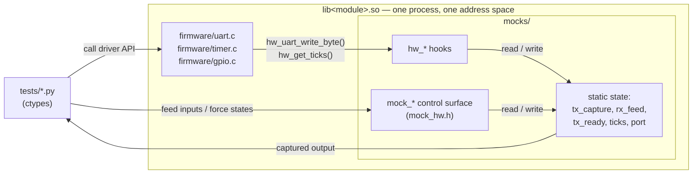
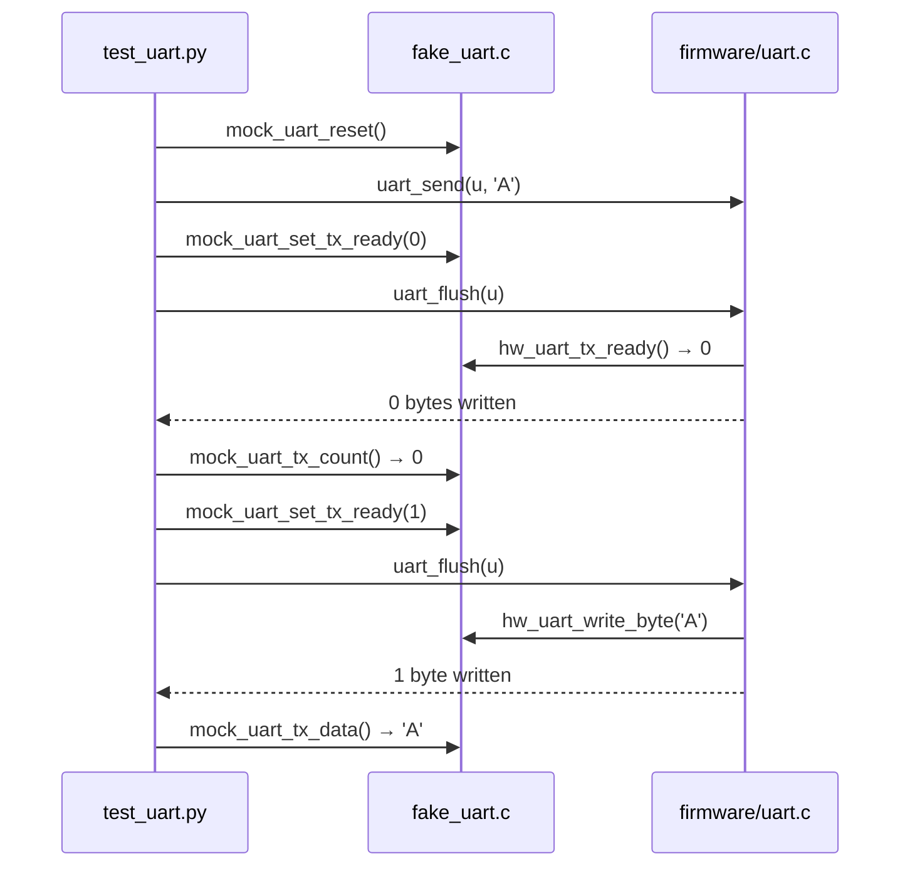

# mocks/ — Fake hardware

Host-side implementations of the `hw_*` hooks that `firmware/` declares but deliberately
leaves undefined. Where a real MCU would have a USART data register or a SysTick counter,
this directory has a `static` array and a `uint32_t`.

Two jobs, and they are worth keeping distinct:

1. **Satisfy the linker** — provide `hw_uart_write_byte()`, `hw_get_ticks()`, etc., so the
   driver objects can be linked into a runnable host binary.
2. **Expose a control surface** — extra `mock_*` functions, declared in `mock_hw.h`, that
   have no hardware counterpart at all. These are the knobs Python turns to inject inputs,
   force edge cases that are hard or impossible to provoke on real silicon, and read back
   what the driver actually emitted.

Nothing in `firmware/` includes `mock_hw.h`, and a real HAL build would not compile this
directory at all.

## Files

| File | Purpose |
| --- | --- |
| `mock_hw.h` | The control surface. Declares every `mock_*` symbol the tests call, grouped by owning file. This is the header Python's `ctypes` calls are written against — read it first. |
| `fake_uart.c` | Implements the four `hw_uart_*` hooks over a 256-byte TX capture buffer and a pre-loadable RX feed buffer. Adds `mock_uart_set_tx_ready()` to hold the peripheral "busy" so the driver's back-pressure path can be tested deterministically. |
| `fake_timer.c` | Implements `hw_get_ticks()` over a plain counter. Tests move time with `mock_timer_set_ticks()` / `mock_timer_advance()`, so timing tests are instant and never flaky — and `advance()` is left to wrap on purpose so 32-bit rollover is testable. |
| `fake_gpio.c` | GPIO needs no hooks (the register struct *is* the hardware), so this file instead offers a process-global `gpio_port_t` via `mock_gpio_port()` — a shared bank a black-box `main()` and Python can both address — plus `mock_gpio_set_idr()` to simulate external pin levels. |

## Design

Each fake owns private `static` state and publishes two disjoint sets of functions: the hooks
the driver calls *downward*, and the controls the test calls *sideways*. The driver has no
symbol for anything in `mock_hw.h`, so the dependency only ever points one way.

Because the driver and the mock are linked into the *same* shared object, Python is inside the
process: it can set a register, call one driver function, and inspect the resulting mock state
with no serialization, no timing window, and no I/O. That is the whole advantage of white-box
mock-hardware mode over the black-box subprocess mode in `harness/`.

A typical back-pressure test reads as arrange / act / assert against the mock:

## Conventions

- **Reset first.** Mock state is process-global and shared libraries are cached across tests
  (`framework/cinterface.py` memoizes the `CDLL` handle), so state leaks between tests unless
  each one calls the module's `mock_*_reset()` up front. The `_lib()` helper in each test file
  does this.
- **Bounded buffers, no allocation.** `MOCK_UART_BUF` is 256 bytes; writes past the end are
  dropped rather than growing a buffer. Fakes stay as allocation-free as the firmware.
- **Fakes, not stubs.** These implement real (if simplified) behavior — the RX feed is
  consumed in order, TX capture preserves ordering — so tests can assert on observable byte
  streams instead of on call counts.
- **The `mock_*` names are intentionally un-HAL-like.** If a symbol starts with `mock_`, it
  disappears in an on-target build; if it starts with `hw_`, it gets a real implementation.
  See `stm32/README.md` for that migration.

## Linking

`framework/config.py` decides which fake is linked with which driver:

| Shared library | Sources |
| --- | --- |
| `libgpio.so` | `firmware/gpio.c` + `mocks/fake_gpio.c` |
| `libtimer.so` | `firmware/timer.c` + `mocks/fake_timer.c` |
| `libuart.so` | `firmware/uart.c` + `firmware/ring_buffer.c` + `mocks/fake_uart.c` |

`ring_buffer` and `crc` are pure logic with no hardware seam, so they link no mock at all.
