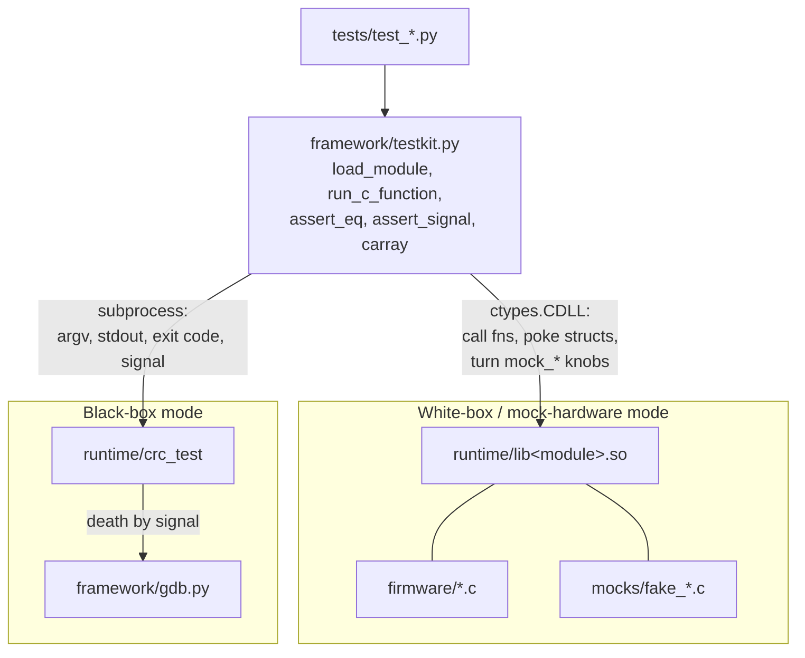
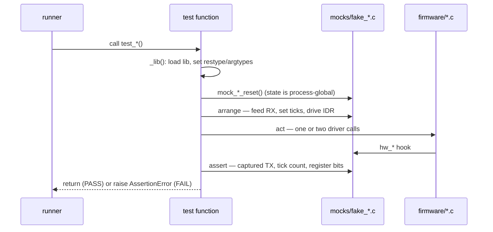

# tests/ — The validation suite

One Python module per firmware module, each asserting on **real compiled C** rather than a
simulation of it. There is no pytest, no unittest, no plugins: a test is a module-level
function named `test_*`, discovered by `framework/runner.py`, that raises `AssertionError` to
fail. Stdlib only.

The emphasis is deliberately on edge cases — overflow, underflow, wrap-around, rollover,
out-of-range indices, `NULL` handles, peripheral back-pressure, bit corruption, and an
injected segfault. Happy paths get one test each; the failure modes get the rest.

## Files

| File | Module under test | What it covers |
| --- | --- | --- |
| `test_ring_buffer.py` | `libring_buffer.so` | FIFO ordering, `put` past capacity → `RB_ERR_FULL`, `get` on empty → `RB_ERR_EMPTY`, index wrap after fill/drain/refill, `NULL` handle rejected instead of dereferenced. |
| `test_crc.py` | `libcrc.so` + `crc_test` | The canonical vector `CRC32("123456789") == 0xCBF43926`, empty-input CRC, single-bit corruption changes the CRC, the black-box executable agreeing with the in-process library, and the `CRASH` input dying by SIGSEGV. The only module exercising both modes. |
| `test_gpio.py` | `libgpio.so` | `set`/`clear`/`toggle` bit mechanics on `ODR`, the 2-bits-per-pin `MODER` encoding (pin 5 → bits [11:10]), reading an injected `IDR` level, pin index ≥ 16 → `GPIO_ERR_RANGE`. |
| `test_timer.py` | `libtimer.so` | Not-expired before the period, expired exactly at it, a stopped timer reporting zero forever, and elapsed-time math staying correct across 32-bit tick rollover (start at `0xFFFFFFF0`, advance 48). |
| `test_uart.py` | `libuart.so` | TX queue → flush → captured bytes in order, injected RX bytes read back in order, software FIFO overflow → `UART_ERR_TX_FULL`, peripheral back-pressure retaining data until ready, empty read → `UART_ERR_RX_EMPTY`. |

## The two interaction modes

Every test picks one of two ways to reach the C code, both provided by
`framework/testkit.py`.

**White-box (mock hardware, via `ctypes`)** — used by four of the five modules. `load_module()`
returns a `CDLL` for `lib<module>.so`; the test mirrors the C structs as `ctypes.Structure`
subclasses, passes them by reference, and reads the resulting fields directly. Because the
driver and its fake hardware are linked into the same process, the test can force a peripheral
state, call one function, and immediately inspect what the driver did.

**Black-box (subprocess)** — used by `test_crc.py`. `run_c_function()` executes a real binary
from `harness/` and returns argv, stdout, the exit code, and the terminating signal. This is
the only mode that can survive a crash of the code under test, so fault injection lives here.



The shape almost every white-box test follows:



## Writing a test

```python
import ctypes
from framework.testkit import load_module, assert_eq

def _lib():
    lib = load_module("ring_buffer")          # runtime/libring_buffer.so
    lib.rb_put.restype = ctypes.c_int         # be explicit about the C ABI
    return lib

def test_rb_overflow():
    """put() past capacity returns RB_ERR_FULL."""
    lib = _lib()
    rb = RingBuffer()
    lib.rb_init(ctypes.byref(rb))
    ...
    assert_eq(lib.rb_put(ctypes.byref(rb), 0xAA), -2, "overflow")
```

Rules that keep this suite trustworthy:

- **Name the function `test_*` and put it at module level.** The runner collects callables
  matching that prefix and runs them in sorted order; anything else is ignored.
- **Set `restype` (and `argtypes` where it matters).** `ctypes` defaults a return type to
  `int`, which silently truncates a `uint32_t` CRC or a `size_t` count. The `_lib()` helper in
  each file exists to do this in one place.
- **Reset mock state at the start of every test.** Shared libraries are cached for the whole
  run, so `static` state in `mocks/` persists across tests. `_lib()` calls
  `mock_uart_reset()` / `mock_timer_reset()` before handing back the handle.
- **Keep `ctypes.Structure` mirrors in lockstep with the headers.** `RingBuffer`, `GpioPort`,
  `Timer`, and `Uart` are hand-written copies of layouts declared in `firmware/*.h`. Nothing
  checks them for you — if a header's fields move, fix the mirror or the test will read
  garbage. Error-code constants (`RB_ERR_FULL = -2`, …) are duplicated for the same reason.
- **Assert with the testkit helpers.** `assert_eq` and `assert_true` produce readable failure
  messages; `assert_signal` is how you assert a specific crash; `carray()` converts `bytes`
  into a `uint8_t[]` buffer to hand into C.
- **Raise `SkipTest` for a missing prerequisite** (an absent `gdb`, say). It reports as `SKIP`
  rather than a failure.
- **One behavior per test, with a docstring stating the expected outcome.** The docstring is
  the specification a reviewer reads; the assertion message is what they see when it breaks.

Adding a test file for a new module also means adding an entry to `TEST_ARTIFACTS` in
`framework/config.py` so the runner knows which libraries and executables to build first.

## Running

```bash
python3 -m framework.runner                    # build what's needed, run everything
python3 -m framework.runner test_uart          # one module ("uart" also works)
python3 -m framework.runner --list             # list discovered modules
python3 -m framework.runner --no-build         # skip gcc, reuse runtime/
python3 -m framework.runner --debug            # auto-capture a GDB backtrace on any crash
python3 -m framework.runner --report html      # also write runtime/report.html
```

Each result is printed, appended to `runtime/logs/runner.jsonl`, inserted into the `test_runs`
table in `runtime/validation.db`, and summarized in `runtime/report.json`. A `FAIL` or `ERROR`
anywhere makes the process exit non-zero, which is what CI keys on.
